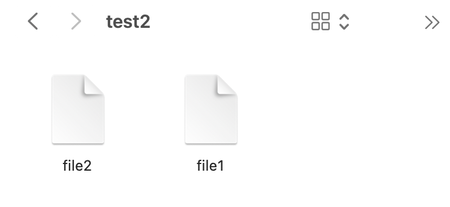

# Лабораторная работа 1. Файловый менеджер

## Цель лабораторной работы:
Научиться создавать сложный проект и научиться программно работать с локальными файлами и папками.

## Задания для выполнения:

Необходимо создать примитивный файловый менеджер. Программа должна работать в определенной папке (рабочей папки менеджера) и позволять пользователю выполнять следующие простые действия в пределах рабочей папки:

1. Создание папки (с указанием имени);

2. Удаление папки по имени;

3. Перемещение между папками (в пределах рабочей папки) - заход в папку по имени, выход на уровень вверх;

4. Создание пустых файлов с указанием имени;

5. Запись текста в файл;

6. Просмотр содержимого текстового файла;

7. Удаление файлов по имени;

8. Копирование файлов из одной папки в другую;

9. Перемещение файлов;

10. Переименование файлов.

## Указания к выполнению

1. Расположение рабочей папки должно указываться в настройках файлового менеджера. Настройки должны располагаться в отдельном от основного исходного кода файле.

2. Файловый менеджер должен блокировать пользователя от выхода за пределы рабочей папки. Пользователь должен воспринимать рабочую папку как корневую и все действия файлового менеджера должны локализоваться только в пределах этой папки.

3. Программный проект должен быть оформлен как код на языке программирования Python и располагаться в определенной папке. Проект должен состоять из нескольких файлов. Расположение рабочей папки не должно быть связано с физическим расположением файлов исходного кода. 
4. Файловый менеджер по умолчанию должен иметь текстовый интерфейс по аналогии с интерфейсом командной строки. Действия пользователя осуществляются вводом с клавиатуры соответствующей команды (по необходимости с параметрами).
5. Код должен быть организован в виде набора функций или классов, каждая операция файлового менеджера должна быть реализована в отдельной функции или методе класса.
6. Файловый менеджер должен быть кроссплатформенным и работать как в среде Windows, так и в UNIX системах. Необходимо протестировать работоспособность программы в разных ОС. Для кроссплатформенности рекомендуется использовать стандартную библиотеку Python для осуществления файловых операций.
7. Разработка программы должна вестись с использованием СКВ Git. Код должен публиковаться в репозитории на GitHub.
8. Перед разработкой программист должен продумать названия и структуру команд для пользователя. Команды не должны повторять команды существующих программных оболочек.

## Дополнительные задания

1. Сделайте файловый менеджер многопользовательским. Добавьте возможность регистрации пользователей. При регистрации каждому пользователю создается своя домашняя папка, в пределах которой он может работать.

2. Придумайте и добавьте дополнительные функциональные возможности для файлового менеджера. 
Сделаем:
Квотирование дискового пространства и отображение занятого оставшегося места.

